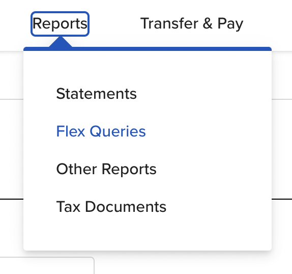
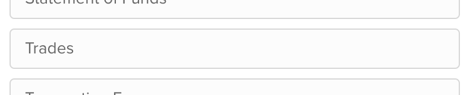
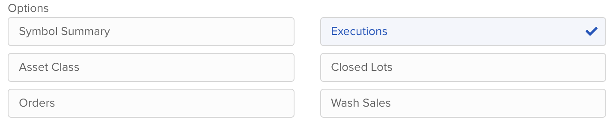
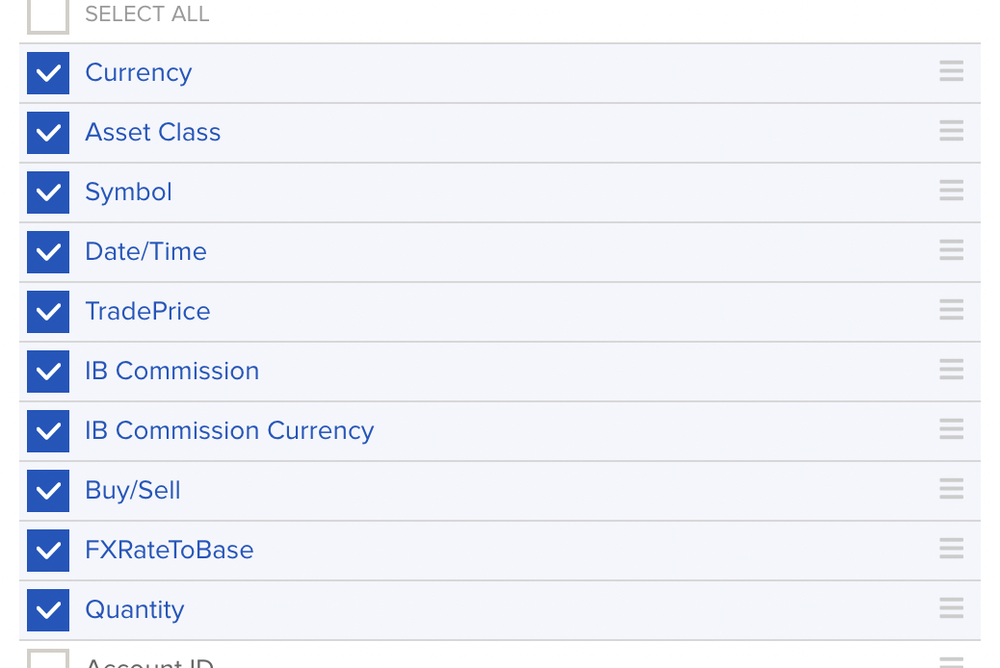
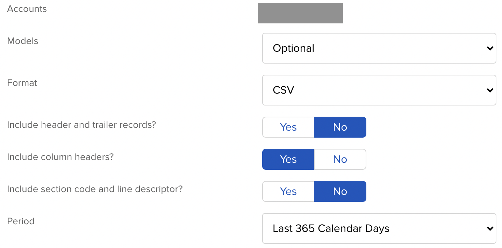
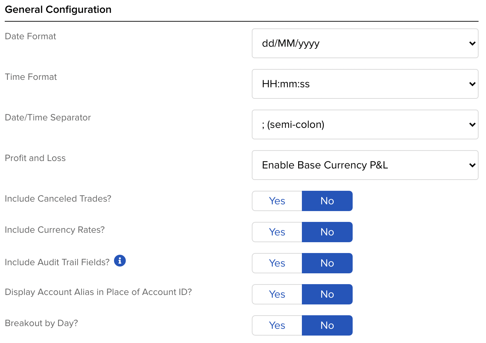
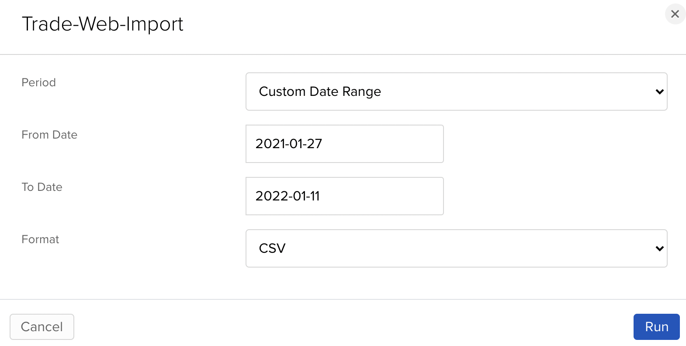

# Interative Brokers UK Capital Gains Tax Calculator

This is a tool to help calculate your capital gains tax from your trades at Interactive Brokers UK.

## Generating the Import CSV

Login to your IB account via the website and navigate to Reports -> Flex Queries

Create a new flex query, name it and select Trades

Ensure only Executions is checked

Select the following fields and hit `Save`

Set the following delivery configuation options. Don't worry about the Period field being incorrect as you get to select the real date range when you actually run the report.

Set the following generation configuration, paying special attention to the Date Format and Time Format fields.

Hit `Continue` and then `Create` on the next page.

When you run the report, you can select a custom date range. Select all the data you can, including previous years.

